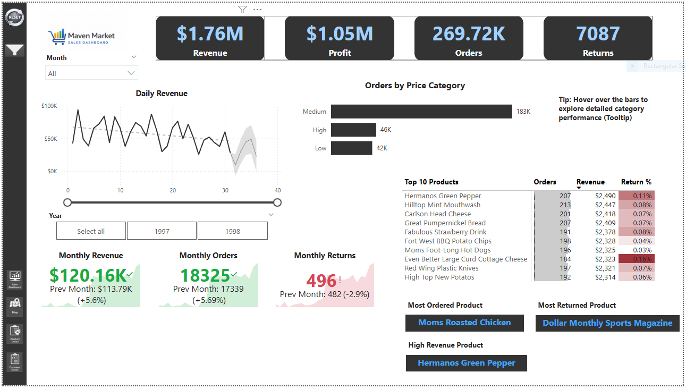
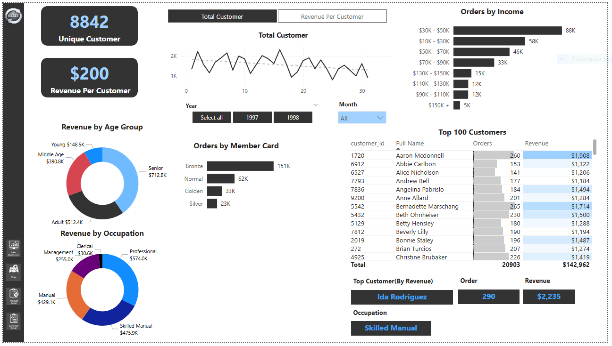

# 📊 Maven Market Sales Dashboard

## 📌 Overview

This project is an interactive Power BI dashboard built to analyze sales performance, customer behavior, and product insights for Maven Market.

## 🔧 Tools Used

* Power BI
* DAX
* Data Visualization

## 📊 Key Features

* Sales performance tracking (revenue, profit, transactions)
* Customer segmentation and insights
* Product performance analysis
* Interactive filters and slicers

## 📸 Dashboard Preview

### 🔹 Sales Analysis

### 🔹 Customer Insights

## 🚀 Insights

* Sales are concentrated in specific product categories
* High-value customers contribute significantly to total revenue
* Seasonal trends impact sales performance
* Certain products generate higher profit margins

## 📌 Conclusion

The dashboard provides a comprehensive view of sales and customer behavior, enabling data-driven decision-making for business growth.
